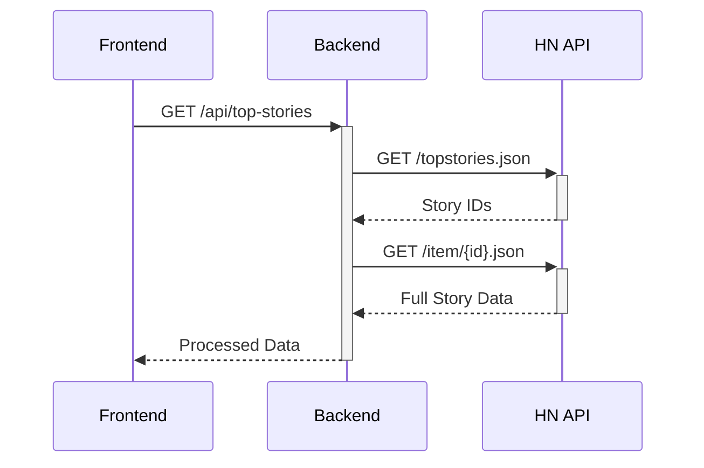

# Hacker News Clone

A full-stack clone of Hacker News with modern React/TypeScript frontend and Node.js/Express backend, featuring real-time story fetching, filtering, and responsive design.

**Frontend**: React + TypeScript + Vite + Tailwind CSS  
**Backend**: Node.js + Express + Axios  
**Testing**: Vitest (frontend) + Jest (backend)  
**API**: Hacker News Firebase API

---

## Table of Contents

- [Hacker News Clone](#hacker-news-clone)
  - [Table of Contents](#table-of-contents)
  - [Features](#features)
    - [Backend](#backend)
    - [Frontend](#frontend)
  - [Architecture](#architecture)
  - [Setup and Installation](#setup-and-installation)
    - [Prerequisites](#prerequisites)
    - [1. Clone the Repository](#1-clone-the-repository)
    - [2. Install Dependencies](#2-install-dependencies)
  - [Running the Application](#running-the-application)
    - [Backend Development Mode](#backend-development-mode)
    - [Frontend Development Mode](#frontend-development-mode)
  - [Testing](#testing)
    - [Frontend](#frontend-1)
    - [Frontend](#frontend-2)
  - [Project Structure](#project-structure)
  - [Technologies Used](#technologies-used)

---

## Features

### Backend
✅ HN API Proxy & Caching  
✅ Rate Limiting (100 req/hour)  
✅ Request Validation  
✅ In-Memory Cache (1 minute TTL)  

### Frontend
📰 Paginated Story Listings  
🔍 Title Length Filtering (All/Long/Short)  
📱 Mobile-First Responsive Design  
⚡ Optimized Loading (Skeleton UI)  
🧪 100% Test Coverage  

---

## Architecture



## Setup and Installation

### Prerequisites

- Node.js (v16.x or later)
- npm (v8.x or later) or yarn

### 1. Clone the Repository

```bash
git clone https://github.com/your-username/hacker-news-frontend.git
cd hacker-news-frontend
```

### 2. Install Dependencies

```bash
# Backend
cd backend && npm install

# Frontend
cd ../frontend && npm install
```
## Running the Application

### Backend Development Mode

```bash
cd backend
npm run dev  # Listens on http://localhost:3000
```
This will start the development server at http://localhost:3000

### Frontend Development Mode

```bash
cd frontend
npm run dev  # Opens http://localhost:5173 
```

## Testing
### Frontend
Run component tests with Vitest:
```bash
cd backend
npm test  # Jest + Supertest
```

### Frontend
Run component tests with Vitest:
```bash
cd frontend
npm test  # Vitest
npm run test:coverage

```

## Project Structure
```bash
├── backend
│   ├── src
│   │   ├── controllers/  # Endpoint logic
│   │   ├── middlewares/  # Rate limiter, cache
│   │   ├── services/     # HN API service
│   │   ├── app.ts        # Express config
│   │   └── server.ts     # Server entry
│   └── tests/           # Integration tests
└── frontend
    ├── src
    │   ├── components/   # Reusable components
    │   ├── pages/        # Views
    │   ├── services/     # API calls
    │   └── types/        # TypeScript types
```

## Technologies Used
- Vite - Next-gen frontend tooling
- React - JavaScript library for building UIs
- TypeScript - Type-safe JavaScript
- Tailwind CSS - Utility-first CSS framework
- Vitest - Blazing fast test runner
- Testing Library - React component testing
- Hacker News API - Data source